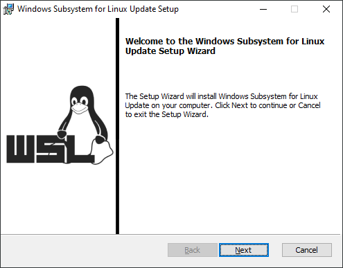

# Docker-Desktop
[Docker Desktop](https://www.docker.com/products/docker-desktop/)

Docker Desktop kan installeras i olika miljöer. Den här guiden fokuserar på Windows.

## Aktivera möjligheten till virtualisering i BIOS

För att använda Docker Desktop behöver datorn ha stöd för virtualisering. Den inställningen görs i BIOS. 

Sök efter *enable virtualization in bios* för den dator som du har.

## Installera Docker Desktop i Windows

Docker Desktop använder WSL *Windows Subsystem for Linux*.  Det är en funktion i Windows som tillåter utvecklare att köra en Linux-miljö utan behov av en separat virtuell maskin eller dubbel uppstart.

För att använda version 2 av WSL krävs Windows 10 version 1903 eller senare (Build 18362).

*Se till att din dator uppfyller kraven och uppdatera Windows*


## Steg 1: Windows funktioner 

Kontrollera att datorn kan hantera Hyper-V genom att visa installerade funktioner i Windows.

Gå via kontrollpanelen eller skriv `optionalfeatures` i Windows sökfält.

Se till att följande funktioner är aktiverade

- Plattform för virtuella datorer
- Windows-undersystem för Linux


*Starta om datorn vid uppmaning*


## Steg 2: Uppdatera Linux kernel

Starta en webbläsare och ladda ner senaste uppdateringen för WSL, installera därefter uppdateringen

`https://wslstorestorage.blob.core.windows.net/wslblob/wsl_update_x64.msi`




## Steg 3: Ange version för Windows-undersystem för Linux

Starta PowerShell, och kör följande kommando:

`wsl --set-default-version 2`

För att kontrollera status för wsl:

`wsl --status`


## Steg 4: Installera Docker Desktop

Hämta installationsfilen för Docker Desktop. Den förvalda bör fungera, men det går annars att hitta tidigare versioner via webbplatsen:

`https://docs.docker.com/desktop/release-notes`

När installationsfilen är hämtad, installera Docker Desktop.


*Starta om datorn vid uppmaning*


## Steg 5: Starta Docker Desktop

När du startar Docker Desktop kommer du först få acceptera villkor och ange några olika val. 


Om Docker Desktop inte startar - se https://docs.docker.com/desktop/troubleshoot-and-support/troubleshoot/


## Steg 6: Docker Desktop - welcome

I en terminal, kör kommando:

```bash
docker run -d -p 8080:80 docker/welcome-to-docker
```


Starta en webbläsare och ange url:

`localhost:8080`


## Visual Studio Code

I Visual Studio Code finns tillägg som kan användas för att hantera WSL:


---


## Hyper-V nested virtualisering

Om Hyper-V används för att en klient ska hantera virtualisering via Docker Desktop ange följande kommando i PowerShell för värden (i exemplet heter den virtuella klienten *Win-1*):

```bash
Set-VMProcessor -VMName Win-1 -ExposeVirtualizationExtensions $true
```


[Run Hyper-V in a Virtual Machine with Nested Virtualization](https://learn.microsoft.com/en-us/virtualization/hyper-v-on-windows/user-guide/enable-nested-virtualization)
